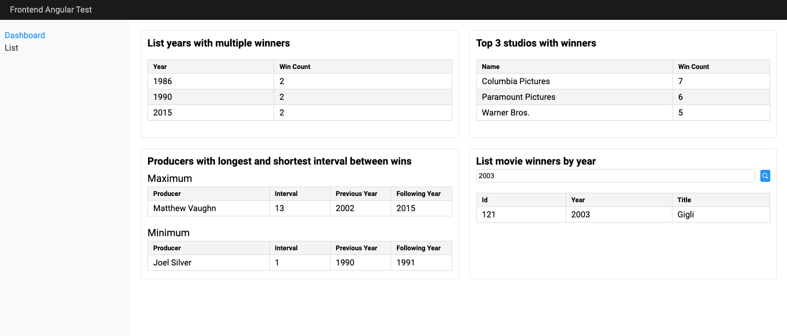
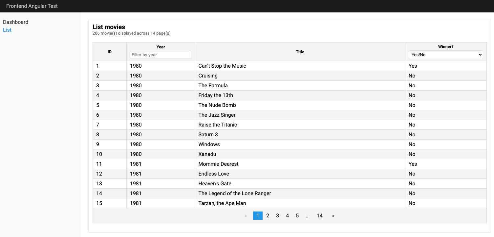
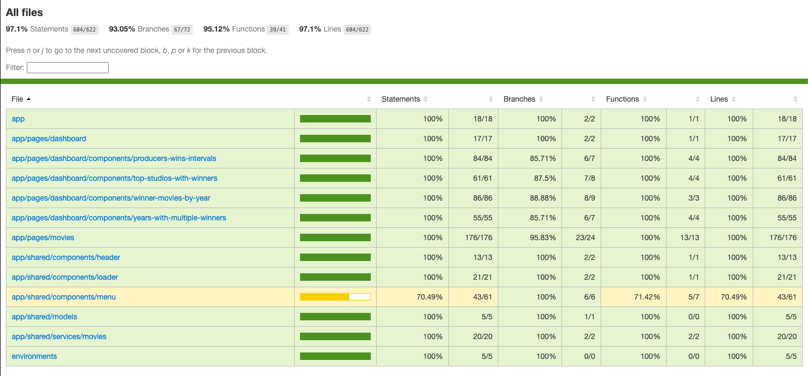

# GoldenRaspberryAwards

Projeto teste desenvolvido em Angular para a Texo IT. As especificações estão no arquivo TexoIT-EspecificacaoTeste.pdf

Abaixo seguem as instruções para execução.

## Especificações

- Projeto gerado com o [Angular CLI](https://github.com/angular/angular-cli).
- Versão do Angular: 16.2.14.
- Versão do Node.js: 18.14.2
- Versão do TypeScript: 5.1.3
- Versão do Jest: 29.7.0

## Executando

- Após clonar o projeto, acesse o diretório raiz da aplicação pelo terminal e execute 'npm i' para instalar as dependências.
- Na sequência, rode o comando 'npm start' para executar a aplicação.
- No navegador, acesse [http://localhost:4200](http://localhost:4200) para ver a aplicação em execução.

## Testes unitários

- Para executar os testes unitários execute o comando 'npm run test:coverage'.
- Após a execução dos testes você pode também ver um relatório web em 'golden-raspberry-awards/coverage/lcov-report/index.html' (abra no navegador).

## Observações

- Faltou concluir poucos testes unitários (menu.component, principalmente). O índice de cobertura ficou em 97.1% Statements, 93.05% Branches, 95.12% Functions e 97.1% Lines (604/622).
- Também faltou utilizar melhor as variáveis de CSS para valores comuns (cores, espaçamentos, ...).
- Se tivesse mais tempo gostaria de ter implementado internacionalização e um controle de temas.
- Não me preocupei em ser 100% fiel ao modelo de telas proposto (isso ficaria mais seguro se tivesse uma referência em um Figma, por exemplo).
- Procurei manter responsivo, independente da resolução mínima sugerida.

## Telas desenvolvidas

- Dashboard

- List

- Relatório de testes

